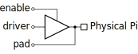

# ALCHA


The ALCHA project, including the language grammar and, by extension, this
wiki, is under development.  This wiki serves as a documentation of the
project goals and aspirations, which are inherently unstable and subject to
change without notice.

--------------------------------------------------------------------------------

## Table of Contents

- [Introduction](Introduction.md)
- [Lexical](Lexical.md)
- [Grammar](Grammar.md)
- [Modules](Modules.md)
- [Declarations](Declarations.md)
  - [Nets](#nets)
    - [Definition](#definition)
    - [Initialisers](#initialisers)
    - [Attributes](#attributes)
    - [Timing Constraints](#timing-constraints)
    - [Bus Connections](#bus-connections)
  - [Pins](#pins)
    - [Definition](#definition)
    - [Direction Inference](#direction-inference)
    - [Pin Net Inference](#pin-net-inference)
    - [Attributes](#attributes)
    - [Pin Vectors](#pin-vectors)
  - [Groups](#groups)
  - [Structures](#structures)
  - [Enumerations](#enumerations)
    - [Base Type and Encoding](#base-type-and-encoding)
    - [ALCHA Enumeration Semantics](#alcha-enumeration-semantics)
  - [Scripting Data Types](#scripting-data-types)
  - [Built-in Members](#built-in-members)
- [Expressions](Expressions.md)
- [Statements](Statements.md)
- [Arrays](Arrays.md)
- [Functions](Functions.md)
- [Synchronous Circuits](SynchronousCircuits.md)
- [Classes](Classes.md)
- [Scripting Features](Scripting.md)
- [Advanced Attributes](AdvancedAttributes.md)
- [High-level Structures](HighLevelStructures.md)
- [Simulation and Verification](Simulation.md)

--------------------------------------------------------------------------------

# Declarations

## Nets

### Definition

Nets relate to physical wires and / or registers on the FPGA.  They are
specified by means of the `net` keyword.  If no format is specified, a net is
a single-bit unsigned integer, which also represents a boolean.  The format is
specified by means of optional instantiation parameters.  Some examples are
shown below:

```alcha
    net          a; // Single-bit unsigned integer
    net(8)       b; // 8-bit unsigned integer
    net(7, -128) c; // 8-bit signed integer

    net(4, 4)    d; // 4-bit unsigned fixed point with 2 integer bits
                    // and 2 fraction bits -- in the range [0, 4)
    net(4, -4)   e; // 5-bit signed fixed-point in the range [-4, 4)
```

Signed nets have one more bit than specified in the format.  This is a
convenient convention for fixed-point digital signal processing, but can be
confusing.  Think about it as: "the number of bits used to store the positive
part of the net".

### Initialisers

All nets, pins and variables can take an optional initialiser,
as illustrated below:

```alcha
    net(8   ) a  = 7;       // The binary value "0000 0111"
    net(8, 4) pi = 355/113; // The binary value "1100 1001"
```

### Attributes

Nets take optional attributes, which are summarised in the table below.

Attribute            | Default | Description
---------            | ------- | -----------
`global`             | `false` | Indicates whether or not the net should be routed on the global clock network.  Takes only `true` or `false` values.
`external_clock`     | `none`  | Specifies the clock used for external setup and hold constraints.
`external_setup`     | `0`     | Specifies the minimum setup time of an external register, in relation to `external_clock`
`external_hold`      | `0`     | Specifies the minimum hold time of an external register, in relation to `external_clock`
`external_min_delay` | `0`     | Specifies the minimum output delay of an external register, in relation to `external_clock`
`external_max_delay` | `0`     | Specifies the maximum output delay of an external register, in relation to `external_clock`
`trace_input_delay`  | `0`     | Specifies the electrical delay between the FPGA pin and the external device
`trace_uncertainty`  | `0`     | Specifies the electrical delay uncertainty between the FPGA pin and the external device

External IC parameters and PCB trance parameters are split into separate
attributes so that they can be specified at different points in the design.
The PCB trace parameters might be specified with the pin definition, for
example, while the external IC parameters are specified in the abstraction
module that controls that IC.

### Timing Constraints

As indicated in the table above, net attributes can be used to specify
external peripheral timing requirements.  These timing attributes are
specified as if there are no PCB or trace delays.  When the net is connected
to a pin, the trace delays and pin capacitance specified by the pin attributes
are used in conjunction with the net timing attributes to calculate the
appropriate external timing constraints.  An example is provided below:

```alcha
// PCB trace delays in the pin definitions:
    pin(4) <voltage = 3.3, capacitance = 10e-12,
            external_min_delay = 500e-12, external_max_delay = 1e-9,
            location = ["U7", "T7", "V8", "T8"]> bpSD_Dat;

// Peripheral specifications in the driver class:
    net(4) < external_clock     = ~clock,
             external_max_delay = 14e-9 > dataIn;

    group  < external_clock = clock,
             external_setup = 5e-9,
             external_hold  = 5e-9 > {
        net(4) dataOut;
        net    dataEnable;
    }

    // Assign the nets to the pin
    dataIn          = bpSD_Dat.pad;
    bpSD_Dat.driver = dataOut;
    bpSD_Dat.enable = dataEnable;
```

External delays are always referenced to a clock, even if the external delay
is purely combinational.  This is so that the timing constraints are
compatible with the Synopsis Design Constraints format, which is the
industry-preferred standard.

### Bus Connections

ALCHA does not support high-impedance nets directly.  Pins can be set to
high-impedance by disabling the driver (see the [Pins](#pins) section for
details). In order to emulate a bus that has a set of tri-state drivers,
the nets should be gated through AND gates and then combined through an OR
gate to drive the bus:

```alcha
    net(16) busData;

    class BusModule{
        input net Enable = 0;

        protected{
            net(16) DataIn = busData;
            net(16) DataOut;
            busData |= DataOut & Enable;
        }
    }
    class Module1 : BusModule{
        // Class content
    }
    class Module2 : BusModule{
        // Class content
    }
```

## Pins

### Definition

Pins in ALCHA are specified by means of the `pin` keyword.  Pins can have
various attributes.  A short example is presented below:

```alcha
    input  pin<frequency = 50e6, voltage = 2.5, location = "H12"> ipClock;
    input  pin<                  voltage = 1.2, location = "P11"> ipKey;
    output pin<                  voltage = 2.5, location = "F7" > opLED;
```

A pin is a structured object that consists of three nets: the `pad` (physical
FPGA pin), the `driver` (input to the pin buffer) and the `enable` (driver
enable).  In order to set a pin to output, the driver must be enabled by
assigning a constant high to the `enable` net.  Bidirectional pins are created
by assigning an expression to the `enable` net.



Open-collector pins can be described as in the following I<sup>2</sup>C example:

```alcha
// Drive low when enabled
    pin bpSClk  = 0;
    pin bpSData = 0;

// But disable by default
    bpSClk .enable = 0;
    bpSData.enable = 0;

// Add a device to the bus
    bpSClk .enable |= ~thisClock;
    bpSData.enable |= ~thisData;

// Add another device to the bus
    bpSClk .enable |= ~thatClock;
    bpSData.enable |= ~thatData;

// Read the Data line
    pin LED = bpSData; // Equivalent to LED.driver = bpSData.pad
```

### Direction Inference

The direction specifiers are optional.  When, at the time of circuit
synthesis, the `enable` net is undefined (and the pin does not have an
explicitly defined direction), the compiler infers the direction of the pin.

If there is an expression assigned to the `driver` net, the pin is an output
and the driver is enabled.  If the `driver` net is also undefined, the pin is
an input and the driver is disabled.

### Pin Net Inference

When the developer assigns directly to the pin name, the expression is
actually assigned to the `driver` net.  When the pin is read, the `pad` net is
read.  This is sometimes problematic, as illustrated in the following example:

```alcha
// Define an external bidirectional bus
    pin(16) bpData = 0;
    bpData.enable  = 0;

// Attempt to add a net to the bus (wrong)
    bpData |= myData & myEnable;

// Correctly add a net to the bus
    bpData.enable |= myEnable;
    bpData.driver |= myData & myEnable;

// Another module can also add itself to the bus
    bpData.enable |= otherEnable;
    bpData.driver |= otherData & otherEnable;
```

The first attempt is wrong, because it is equivalent to:

```alcha
    bpData.driver = bpData.pad | (myData & myEnable);
```

which is not what the developer had in mind.

When ignoring the first (wrong) assignment, the code above is equivalent to
the following Verilog:

```verilog
    module TopLevel(
        inout [15:0]bpData;
    );

    wire   bpData_enable = myEnable | otherEnable;
    wire   bpData_driver = myData    & {16{myEnable}}
                         | otherData & {16{otherEnable}};

    assign bpData = bpData_enable ? bpData_driver : 16'bZ;
```

### Attributes

The table below summarises pin attributes and their default values:

Attribute     | Default    | Description
---------     | -------    | -----------
`location`    | `"None"`   | The physical pin number on the target device.  In the case of a differential pair, the pin location is specified in `"PP-NN"` format, where `PP` is the positive pin number and `NN` the negative pin number.
`voltage`     | `3.3`      | The voltage of the I/O bank.
`current`     | `5e-3`     | The intended maximum current of the pin, in case of an output.
`capacitance` | `10e-12`   | The load capacitance of the pin, in case of an output.
`standard`    | `"LVCMOS"` | The logic standard of the pin.
`termination` | `false`    | Indicates whether or not the pin should enable the internal termination.  Takes only `"true"` or `"false"` values.
`frequency`   | `"None"`   | In the case of a clock input, the frequency of the clock.
`jitter`      | `0`        | In the case of a clock input, the clock jitter.

The string-style parameters (such as IO standard) translate verbatim to
whatever format the vendor IDE uses, so must use the same spelling.

### Pin Vectors

When specifying pin locations for bit-vectors or pin arrays, the `location`
attribute contains a comma-separated list of pins.  Pin locations are
specified most-significant bit first, as follows:

```alcha
    // Assign H9 to LED(7), H8 to LED(6), ..., L7 to LED(0)
    pin(8)<location = ["H9", "H8", "B6", "A5", "E9", "D8", "K6", "L7"]> LED;
```

Pin arrays are handled in similar fashion.  The first (0-index) pin
location(s) are specified first, then the next (1-index), etc.  All the
locations are comma-separated.

The same location can be assigned to different pin objects.  This is useful
when the physical board can have different functions on the same pin, such as
a choice between single-ended or LVDS.  This is illustrated below:

```alcha
    pin(4) <
        standard    = "LVDS",
        termination =  true,
        location    = ["L12-K11", "H18-H17", "M11-L11", "N12-M12"],
    > HSMC_RX;

    group <standard = "LVCMOS">{
        pin(4) <location = ["L12", "H18", "M11", "N12"]> HSMC_RX_p;
        pin(4) <location = ["K11", "H17", "L11", "M12"]> HSMC_RX_n;
    }
```

The compiler will remove pin objects that have no expressions assigned to any
of the pin nets, thereby removing the duplicate pin allocation.  Pins within a
vector or array are treated as independent objects, so the design can mix LVDS
and LVCMOS pins of the above example as follows:

```alcha
    net   ipReceived = HSMC_RX[1..0];
    alias opData     = :[ HSMC_RX_p[3], HSMC_RX_n[3],
                          HSMC_RX_p[2], HSMC_RX_n[2] ];
    opData = mySignal;
```

## Groups

Often there are attributes that apply to many objects.  In this case, the
definitions can be grouped.  All child definitions inherit the attributes of
the group.  When a child definition includes an attribute that is already
defined in the group, the child definition takes precedence.  Below is an
example of a named group for pin definitions.

```alcha
    group<voltage = 3.3, capacitance = 10e-12,
          external_min_delay = 500e-12, external_max_delay = 1e-9> SD{
        pin   <location = "AB6"                   > opClk;
        pin   <location = "W8"                    > bpCmd;
        pin(4)<location = ["U7", "T7", "V8", "T8"]> bpDat;
    }
```

In this case, the pins that are actually defined are `SD.opClk`, `SD.bpCmd`
and `SD.bpDat`.  The group can also be anonymous, as given below. In this
case, each pin is a child of the parent group object (global, in this case).

```alcha
    group <voltage = 3.3, frequency = 50e6>{
        pin<location = "R20"> ipClock_B5B;
        pin<location = "N20"> ipClock_B6A;
    }
```

Nets, class instances, derived clocks, etc. can be grouped in similar fashion.

## Structures

ALCHA structures are "packed", which makes it possible to treat the structure
as if it is a bit-vector.  It is therefore possible, for example, to assign a
multi-member structure to the input port of a RAM block and then assign the
output of the RAM block to a different instance of the same structure.  The
user does not need to use concatenation in the process.

Structures are defined by means of the `struct` keyword, as follows:

```alcha
    struct double{
        net     Sign;
        net(11) Exponent;
        net(52) Mantissa;
    }
```

These structures follow the same rules as SystemVerilog structures, i.e. they
are specified from most-significant to least-significant bit.  An instance of
a structure can be used as if it is a bit-vector.

## Enumerations

An enumeration type can be defined by means of the `enum` keyword,
as illustrated below.

```alcha
    enum State { Idle, Writing, Done, Others }
    num(State) state = Idle;

    rtl(clk, reset){
        switch(state){
            case(Idle){
                // Do some stuff
                state = Writing;
            }
            case(Writing){
                // Do some stuff
                state = Done;
            }
            case(Done){
                // Do some stuff
                state = Idle;
            }
            default{
                // Do some stuff
            }
        }
    }
```

The constant names are not in global scope.  They are only valid when compared
with or assigned to an object of that enum type.  This is similar in behaviour
to VHDL enumerations.

### Base Type and Encoding

By default, the numerical constants associated with the enumeration start at 0
for the first element and increase by 1 for each element.  The user can,
however, assign arbitrary constants to the enumeration members:

```alcha
    enum Colours{
        Red   = 0xFF0000,
        Green = 0x00FF00,
        Blue  = 0x0000FF
    }
```

Ordinarily, enumerations are equivalent to the non-synthesisable type `num`.
The enumeration can, however, be used to define a synthesisable enumeration,
as shown below.

```alcha
    enum State { Idle, Writing, Done, Others }
    pin(State) pinState; // Pin enumeration
    net(State) netState; // Net enumeration
```

In this case, the number of bits, or width, of the net (or pin array) is the
number of bits required to uniquely identify each enumeration value.  In the
above example, this is 2&nbsp;bits.  If the enumeration was declared with the
`encoding = "one-hot"` attribute, the vectors would be 4~bits wide.

```alcha
    enum <encoding = "one-hot"> State { Idle, Writing, Done, Others }

    // This state is of type net(4)
    net(State) state = Idle;

    // This overrides the encoding, so state is of type net(2)
    net(State) <encoding = "Johnson" > state = Idle; //

    // This does a manual Gray encoding
    enum State { Idle = 0b00, Writing = 0b01, Done = 0b11, Others = 0b10 }
```

### ALCHA Enumeration Semantics

A variable declared as an enumeration can only take values from that
enumeration.  If the LHS of an assignment is an enumeration instance, the
compiler pushes that enumeration onto the name-space stack.  If an enumeration
is used outside a variable of that type, the values of the enumeration can be
referenced through its type.  It is illegal to assign anything else to an
enumeration type. It is legal to compare an enumeration to other types,
however.  The code below shows various examples of legal and illegal statements.

```alcha
    enum Enum { A, B, C }

    num  a;
    Enum e, n;

    a = A;          // Illegal: A does not exist in this name-space
    a = Enum.A;     // Legal  : A represents an integer value
    e = B;          // Legal  : assigning a value to the enumeration
    n = e;          // Legal  : the enumeration types are the same
    e = 2;          // Illegal: must assign a value from the defined list
    a = e;          // Legal  : e is automatically cast to an integer
    if(e == B){...} // Legal  : comparing enumeration values
    if(a == B){...} // Illegal: B does not exist in this name-space
    if(e == 2){...} // Legal  : e is automatically cast to an integer
```

## Scripting Data Types

The table below summarises ALCHA scripting variable types:

Keyword | Description
------- | -----------
`byte`  | 8-bit unsigned integer typically used for binary file I/O
`char`  | 32-bit Unicode character typically used for text file I/O
`num`   | Infinite precision, rational, signed complex numbers (see [GNU MP](https://gmplib.org/) and [GNU MPFR](http://www.mpfr.org/))

When a floating-point is assigned to a `num` type, the same precision as the
floating-point is used to determine the size of the components of the rational
number.

More on scripting in the [Scripting Section](p/alcha/wiki/Scripting)

## Built-in Members

Various ALCHA types have built-in attributes.  The list below is not exhaustive.

Member      | Types           | Description
------      | -----           | -----------
`width`     | `pin`, `net`    | The number of bits in the vector.  Returns `1` for scalers.
`length`    | All array types | The number of elements in the array.
`frequency` | Clock nets      | The frequency of the clock, in Hz.

--------------------------------------------------------------------------------

