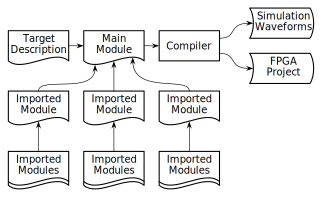

# ALCHA


The ALCHA project, including the language grammar and, by extension, this
wiki, is under development.  This wiki serves as a documentation of the
project goals and aspirations, which are inherently unstable and subject to
change without notice.

--------------------------------------------------------------------------------

## Table of Contents

- [Introduction](Introduction.md)
- [Lexical](Lexical.md)
- [Grammar](Grammar.md)
- [Modules](#modules)
  - [Target Independence](#target-independence)
  - [Import and Name-space](#import-and-name-space)
  - [Environment Inheritance](#environment-inheritance)
  - [Name-space Stack](#name-space-stack)
- [Declarations](Declarations.md)
- [Expressions](Expressions.md)
- [Statements](Statements.md)
- [Arrays](Arrays.md)
- [Functions](Functions.md)
- [Synchronous Circuits](SynchronousCircuits.md)
- [Classes](Classes.md)
- [Scripting Features](Scripting.md)
- [Advanced Attributes](AdvancedAttributes.md)
- [High-level Structures](HighLevelStructures.md)
- [Simulation and Verification](Simulation.md)

--------------------------------------------------------------------------------

# Modules

## Target Independence

The intended target (simulation, Altera project, Xilinx project, etc.) is
specified by menas of global attributes. The code should assign these
attributes in order to select the correct target.  For example:

```alcha
    'target'type   = "Project";
    'target'vendor = "Altera";
    'target'series = "Cyclone V";
    'target'device = "5CSEMA4U23C6N";
    'target'board  = "DE0-Nano-SoC rev C1";
```

These global attributes are used to select the back-end processor.  They can
also be used to perform conditional compilation, as follows:

```alcha
    if('target'type == "Simulation"){
        // Some simulation-specific code
    }else if('target'vendor == "Altera"){
        // Some Altera-specific code
    }else if('target'vendor == "Xilinx"){
        // Some Xilinx-specific code
    }else if('target'vendor == "Efinix"){
        // Some Efinix-specific code
    }
```

## Import and Name-space

Conceptually, ALCHA processes the source as a whole. It is convenient,
however, to break the source into a hierarchical structure of files, as
presented in the figure below.  In the context of ALCHA, a "module" refers to
a source file, rather than an HDL module. An ALCHA module might or might not
compile to a corresponding HDL module, depending on the source contents.



The `import` statement is used to import a child module into a parent module.
There are two forms, as shown below.  The first form imports the contents of
"UART.alc" into the same name-space as the parent module, as if the file
contents appeared in place of the `import` statement.  The second form imports
the contents of "Ethernet.alc" into the "Eth" name-space.  It is illegal to
import two modules into the same name-space within the same module.  In both
forms, the imported modules have direct access to objects in the parent module
name-space.

```alcha
    import "UART";
    import "Ethernet" as Eth;
```

It is, however, legal to import two modules into the same group name-space:

```alcha
    group Libraries{
        import "UART";
        import "Ethernet";
    }
```

The path is searched as follows:

- If the path is absolute, use it directly
- If the path is relative, search the path of the current file
- If that fails, search the path of the top-level module
- If that fails, search the current working directory

Imported modules must be syntactically complete, meaning that the contents of
the imported source file must parse to a self-standing AST from the root of
the EBNF.

## Environment Inheritance

The name-space model allows imported modules full access to all symbols
defined in the parent at the point of import.  This is done without ports
or parameter passing.

The target and pin definitions are examples of where this is useful.
For example:

```alcha
// In "Platform.alc"
    input  pin<frequency = 50e6, location = "V11"> ipClock;
    input  pin<location = "H5"> ipReset;
    output pin(2) <location = [ "AA23", "Y16" ]> opLEDs;

// In "TopLevel.alc"
    import "Platform";
    import "LED_Driver";

// In "LED_Driver.alc"
    net(24) count = 0;
    rtl(ipClock, ipReset) count++;
    opLEDs = count[23..22];
```

As another example, the developer might, for instance, define a `round`
function, which is used by child modules whenever signals must be rounded.
The rounding behaviour of the design can then be changed by simply modifying
the behaviour of this `round` function.  For example:

```alcha
// In "Behaviour.alc"
    net round(net n){
        num msb = n'width;
        num lsb = msb - result'width + 1;
        result := n[msb..lsb] + n[lsb-1];
    }

// In "TopLevel.alc"
    import "Behaviour"
    import "Processor"

// In "Processor.alc"
    net(16) audioOut = 0;
    rtl(clk, reset){
        audioOut = round(audioIn * volume);
    }
```

Different rounding behaviour (such as clipping) can be chosen by changing the
"Behaviour" import.

## Name-space Stack

Specifying the class instance, or name-space, can become tedious.  Instead,
the developer can temporarily push a name-space onto the scope stack by means
of a special syntax, as shown below. The `A.{` construct pushes the `A`
name-space onto the stack, whereas the `B.{` construct pushes the `B`
name-space. The closing curly braces pop the name-spaces from the stack.

```alcha
    struct Colour{ net(8) r, g, b, a; }
    struct Vertex{ net(8) x, y, z, w; }
    Colour fragmentColour;
    Vertex coordinate;

    // Instead of saying:
    :[ fragmentColour.r, fragmentColour.g,
       fragmentColour.b, fragmentColour.a ] =
        :[ coordinate.x, coordinate.y,
           coordinate.z, coordinate.w ] + 1234;

    // Say:
    fragmentColour.{
        coordinate.{
            :[ r, g, b, a ] = :[ x, y, z, w ] + 1234;
        }
    }
```

When referring to a symbol, the name-space stack is searched top to bottom.

--------------------------------------------------------------------------------

